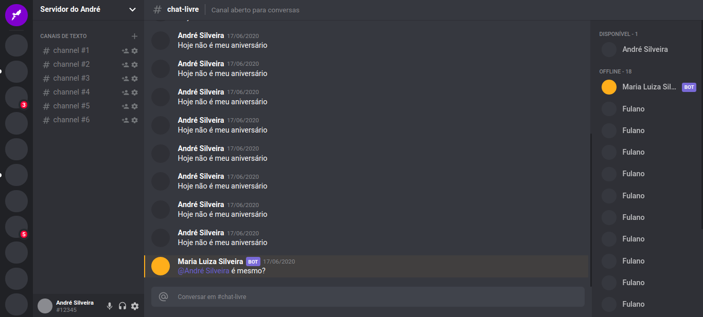

<h4 align="center">
  Discord Clone UI
</h4>

  
   

## FRONT END

- [React](https://reactjs.org)
- [Styled Components]

## Project

Clone interface UI web from Discord App

## Install

- Download and install: Node JS, React
- Clone or download repository
- cd into the clone-discord
- npm install or yarn to download dependencies
- Run Front End yarn start
